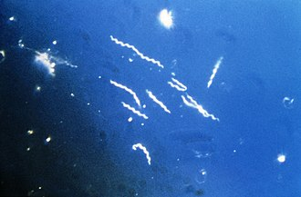

```{r, message = FALSE, warning = FALSE}
# Importing libraries
library("dplyr")
library("annotate")
```

## Part I

```{r}
# Importing the sequences from the Download script
Sequences <- read.csv("Sequences.csv")
letters <- c("A", "C", "T", "G")
counts <- matrix(0, nrow = nrow(Sequences), ncol = 4)
colnames(counts) <- letters
# Iterating through each sample in sequences to find the counts for each base
for (i in 1:nrow(Sequences)) {
  for (j in 1:4) {
    letter <- letters[j]
    counts[i, j] <- nchar(gsub(letter, "", Sequences$Sequence[i]))
  }
  counts[i, ] <- nchar(Sequences$Sequence[i]) - counts[i, ]
}
# Construct and display table for the counts
counts <- as.data.frame(counts)
counts <- cbind(Sequences, counts)
counts <- counts %>% dplyr::select(-"X")
print(counts %>% dplyr::select("Sequence"))
print(counts %>% dplyr::select(c("A", "C", "T", "G")))
```

```{r}
# Retrieving the Sequence IDs and modifying them to the desired format using regex
Sequence_ID <- Sequences %>% dplyr::select("Name") %>% mutate(Sequence_ID = gsub("^>(\\S+).*", "\\1", Name)) %>% dplyr::select(-"Name")
# Calculating GC%
GC_Content <- counts %>% dplyr::mutate(GC_Content = (G + C) / (A + C + T + G) * 100) %>% dplyr::select("GC_Content")
GC_df <- cbind(Sequence_ID, GC_Content)
GC_df
```



[Borrelia burgdorferi](https://en.wikipedia.org/wiki/Borrelia_burgdorferi)

## Part II

```{r}
# The unknown sequence
unknown <- "GCCTGATGGAGGGGGATAACTACTGGAAACGGTAGCTAATACCGCATGACCTCGCAAGAGCAAAGTGGGGGACCTTAGGGCCTCACGCCATCGGATGAACCCAGATGGGATTAGCTAGTAGGTGGGGTAATGGCTCACCTAGGCGACGATCCCTAGCTGGTCTGAGAGGATGACCAGCCACACTGGAACTGAGACACGGTCCAGACTCCTACGGGAGGCAGCAGTGGGGAATATTGCACAATGGGCGCAA"
# Genbank lookup
blast_df <- blastSequences(unknown, as='data.frame')
# Displaying the organism the lookup returned, the length of the match, and the scores of the match
head(blast_df %>% dplyr::select(c("Hit_accession", "Hit_def", "Hit_len", "Hsp_score", "Hsp_evalue")))
```

The sequence is not human. Detecting for matching sequences on Genbank returns hits for the bacteria Yersinia pestis as indicated in the "Hit_def" Therefore, it is likely that this strand of DNA obtained is from the bacteria and serves as evidence that the patient may have an infection. This organism is commonly known to be the cause of the plague pandemic and the Black Death and is most likely the reason the individual is experiencing life-threatening symptoms.